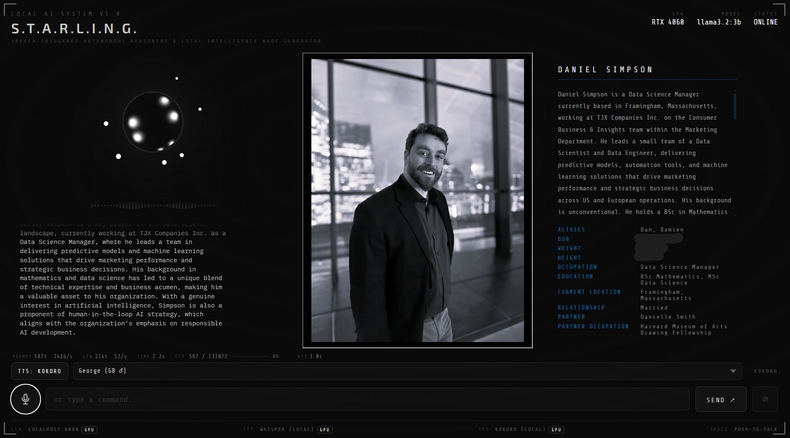
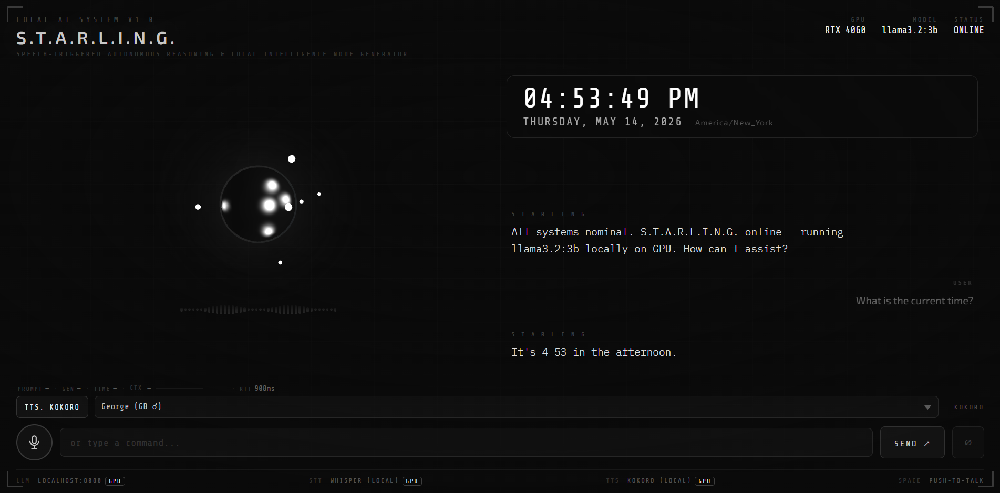
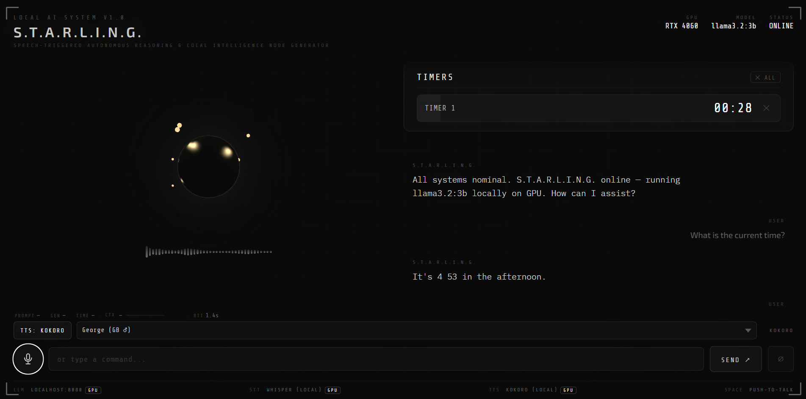
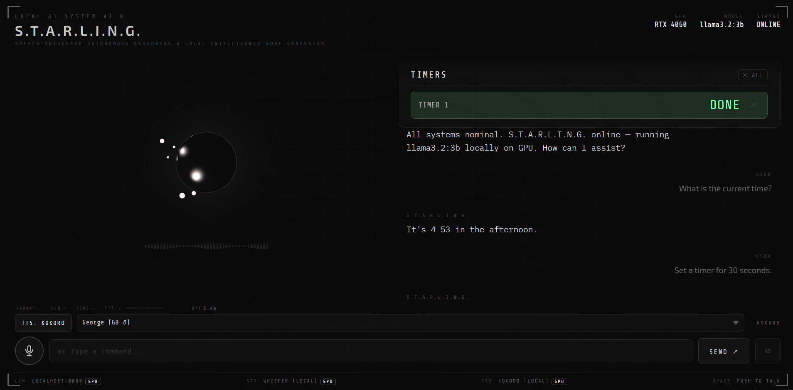
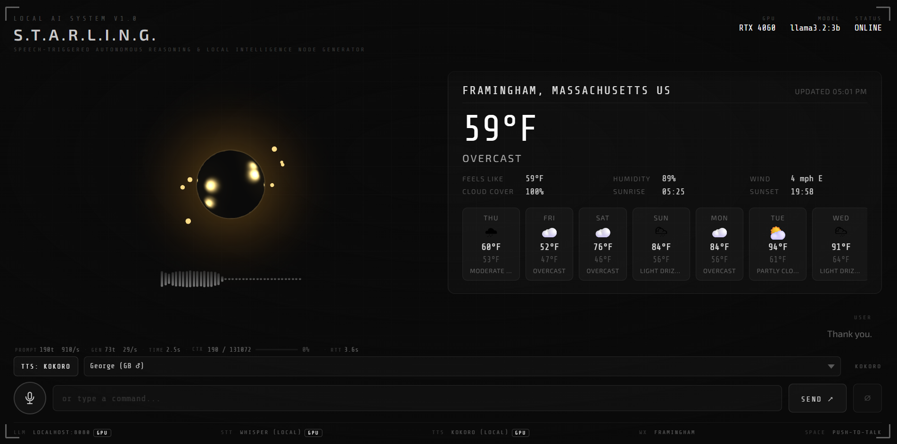
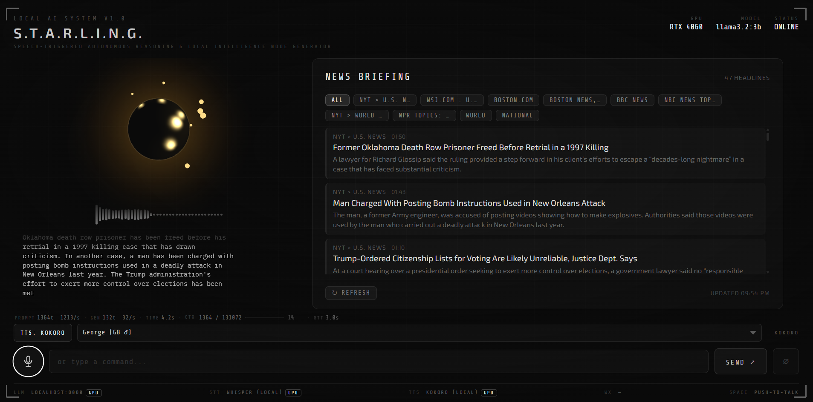

# S.T.A.R.L.I.N.G. — Speech‑Triggered Autonomous Reasoning & Local Intelligence Node Generator

A voice-driven AI interface powered entirely by a local LLM running on your GPU. No cloud APIs. No subscriptions. No Ollama wrapper. Just your hardware.

```
Microphone → Speech-to-Text → llama-server (LLM on GPU) → Text-to-Speech → Browser UI
```


---

## Features

- 🎙 **Voice input** via browser MediaRecorder API → local faster-whisper (Whisper)
- 🧠 **Local LLM inference** directly via llama-server (llama.cpp) — no Ollama wrapper; Ollama kept as a switchable fallback
- ⚡ **Sub-3-second end-to-end latency** — typical voice → LLM → first TTS audio in under 3 s; all three pipelines (Whisper, Kokoro, llama-server) run on GPU
- 🔊 **Text-to-speech** via Kokoro TTS (local, GPU-accelerated) or browser SpeechSynthesis
- 📡 **Sentence-chunked streaming** — each sentence is synthesised and played as it arrives
- 💬 **Multi-turn conversation** with persistent context
- 🌑 **Living black sphere** — Three.js scene with 7 orbiting light orbs; reacts to audio input and shifts colour/speed per state (idle / listening / thinking / speaking)
- ⚡ **Model warm-up on load** — Kokoro and Whisper CUDA sessions are pre-heated at startup; UI shows `INITIALISING…` and GPU badges populate before the user speaks
- 📊 **LLM metrics bar** — live prompt tokens, generation speed (t/s), total time, and context window fill percentage after every response
- 🔒 **Fully local** — no data leaves your machine
- 🗄️ **RAG memory system** — ChromaDB + BM25/vector fusion retrieval; drop `.md` or `.txt` files into `memory/input/` and run `make rag-ingest` to index them
- 🖼️ **Dynamic dossier / presentation mode** — say `"pull up the dossier on [name]"` to trigger a full UI reconfiguration with image panel, structured subject profile, and automatic LLM spoken briefing
- 🕒 **Time & date queries** — instant voice responses ("what time is it?", "what day is it?") with a live clock panel; zero backend, sub-200 ms
- ⏱️ **Voice-activated timers** — set, cancel, and list multiple named timers entirely in-browser; Web Audio API chime on completion
- 🌤️ **Weather panel** — say "what's the weather?" to open a 7-day forecast panel sourced from Open-Meteo (free, no API key); LLM delivers a spoken conditions summary
- 📰 **News briefing panel** — say "what's the news?" to open a live headlines panel sourced from configurable RSS feeds; LLM delivers a spoken multi-story briefing

**Presentation / dossier mode:**



**Time & date panel:**



**Timer panel:**





**Weather panel:**



**News panel:**



---

## Planned Tool Kit (Phase 11)

A suite of voice-activated tools is planned as the next major phase. Each tool is a
self-contained intercept added before the LLM pipeline — none break existing functionality.
Full implementation guides live in the [`markdown/`](./markdown/) folder.

| # | Tool | Guide | Backend | Status |
|---|---|---|---|---|
| 1 | Time & Date | [`markdown/complete/TIME.md`](./markdown/complete/TIME.md) | None | ✅ Done |
| 2 | Timers | [`markdown/complete/TIMER.md`](./markdown/complete/TIMER.md) | None | ✅ Done |
| 3 | Weather | [`markdown/complete/WEATHER.md`](./markdown/complete/WEATHER.md) | Open-Meteo (free, no key) | ✅ Done |
| 4 | News Briefing | [`markdown/complete/NEWS.md`](./markdown/complete/NEWS.md) | RSS / feedparser (free) | ✅ Done |
| 5 | Stocks & Crypto | [`markdown/STOCKS.md`](./markdown/STOCKS.md) | yfinance (unofficial) | 🔲 Planned |
| 6 | Wake Word & Interrupt | [`markdown/WAKE_WORD.md`](./markdown/WAKE_WORD.md) | None | 🔲 Planned |
| 7 | In-UI Browser Panel | [`markdown/WEBCALL.md`](./markdown/WEBCALL.md) | None | 🔲 Planned |
| 8 | Ideas Tracker | [`markdown/IDEAS_TRACKER.md`](./markdown/IDEAS_TRACKER.md) | Local JSON file | 🔲 Planned |
| 9 | Voice Journal | [`markdown/JOURNAL.md`](./markdown/JOURNAL.md) | Local JSON files | 🔲 Planned |
| 10 | Wikipedia RAG | [`markdown/WIKIPEDIA.md`](./markdown/WIKIPEDIA.md) | FAISS + embeddings | 🔲 Planned |
| 11 | Google Calendar | [`markdown/CALENDAR.md`](./markdown/CALENDAR.md) | Google Calendar API (OAuth2) | 🔲 Planned |
| 12 | Gmail | [`markdown/GMAIL.md`](./markdown/GMAIL.md) | Gmail API (OAuth2) | 🔲 Planned |

Tools are ordered from lowest to highest risk of disrupting the current pipeline. See
[`TODO.md — Phase 11`](./markdown/TODO.md) for the full implementation checklist and intercept
ordering reference.

---

## Requirements

- **OS:** Linux, macOS, or Windows
- **GPU:** NVIDIA GPU with 6 GB+ VRAM (CUDA 12+), or DirectX 12-capable GPU (DirectML)
- **Python:** 3.11+
- **Node.js:** 18+ (only if using the React/Vite frontend)
- **Browser:** Chrome or Edge (required for MediaRecorder / Web Speech API fallback)

### Recommended GPU / model pairings

Model files are read directly from the GGUF format. The easiest source is your existing Ollama blob cache (`%USERPROFILE%\.ollama\models\blobs\`) — no re-download needed.

| GPU VRAM | Recommended model | GGUF quant |
|---|---|---|
| 4–6 GB | Gemma 3 4B, Phi-4 Mini, Llama 3.2 3B | Q4_K_M |
| 6–8 GB | Llama 3.1 8B, Mistral 7B, Qwen 2.5 7B | Q4_K_M |
| 10–16 GB | Llama 3.1 13B, Mistral 12B | Q4_K_M |
| 40 GB+ | Llama 3.1 70B | Q4_K_M |

### Currently installed models

| Model | Size | Notes |
|---|---|---|
| `llama3.1:8b` | 4.9 GB | Strong general purpose |
| `mistral:7b` | 4.4 GB | Fast, good instruction following |
| `qwen2.5:7b` | 4.7 GB | Strong coding and reasoning |
| `gemma3:4b` | 3.3 GB | Lightweight, good for low VRAM |
| `llama3.2:3b` | 2.0 GB | **Default** — fastest response times |
| `phi4-mini` | 2.5 GB | Microsoft, strong reasoning for its size |
| `nomic-embed-text` | 274 MB | Embedding model — no longer required; RAG uses fastembed in-process |

These are available as Ollama blobs at `%USERPROFILE%\.ollama\models\blobs\`. Point `start_llama_server.bat` at the relevant blob path or copy and rename to a `models/` directory.

---

## Project Structure

```
llm-speech-UI/
├── frontend/               # UI — HTML/CSS/JS + Three.js
│   ├── index.html
│   ├── style.css
│   └── app.js
├── backend/                # FastAPI server
│   ├── main.py
│   ├── stt.py              # Speech-to-text via faster-whisper
│   ├── tts.py              # Text-to-speech via Kokoro
│   ├── llama_server.py     # llama-server streaming relay (DEFAULT, LLM_BACKEND=llama)
│   ├── ollama.py           # Ollama streaming relay (fallback, LLM_BACKEND=ollama)
│   └── rag.py              # RAG module — ingest, retrieve, format, status
├── memory/
│   └── input/              # Drop .md / .txt files here; run 'make rag-ingest' to index
├── assets/
│   ├── images/
│   │   └── manifest.json           # Subject → image / dossier mapping for presentation mode
│   ├── dossier_images/             # Subject portrait images
│   └── dossier_descriptions/       # Structured subject profiles (.md files)
├── markdown/               # Implementation guides for planned and completed features
│   ├── TODO.md             # Full phased build checklist (Phases 1–11)
│   ├── TIME.md             # Tool: time & date queries
│   ├── TIMER.md            # Tool: voice-activated timers
│   ├── WEATHER.md          # Tool: weather forecast panel
│   ├── NEWS.md             # Tool: news briefing panel
│   ├── STOCKS.md           # Tool: stocks & crypto panel
│   ├── WAKE_WORD.md        # Tool: wake word ("Hey Starling") + interrupt
│   ├── WEBCALL.md          # Tool: in-UI browser panel
│   ├── IDEAS_TRACKER.md    # Tool: voice ideas capture & review
│   ├── JOURNAL.md          # Tool: multi-turn voice journal
│   ├── WIKIPEDIA.md        # Tool: Wikipedia RAG Q&A
│   ├── CALENDAR.md         # Tool: Google Calendar integration
│   ├── GMAIL.md            # Tool: Gmail inbox & summarisation
│   └── complete/           # Guides for already-implemented features
│       ├── IDEAS.md        # (general improvement brainstorm log)
│       └── RAG_IMPLEMENTATION.md
├── scripts/
│   ├── setup.sh                # One-shot install script
│   ├── download_models.py      # Download Kokoro model files
│   └── start_llama_server.bat  # Launch llama-server on Windows (CUDA)
├── .env.example            # Environment variable template
├── requirements.txt        # Python dependencies
└── README.md
```

---

## Quickstart

### 1. Download llama-server and a model

```powershell
# Download llama-server (Windows CUDA 12) from:
# https://github.com/ggml-org/llama.cpp/releases/latest
# Extract to C:\llama.cpp\ and add to PATH

# Model files can be reused from your Ollama blob cache:
# %USERPROFILE%\.ollama\models\blobs\sha256-<hash>
# Point start_llama_server.bat at the relevant blob and run it.
```

### 2. Clone the repo

```bash
git clone https://github.com/danielbsimpson/llm-speech-UI.git
cd llm-speech-UI
```

### 3a. Frontend only (easiest — no Python needed)

Open `frontend/index.html` directly in Chrome. The UI talks to Ollama at `http://localhost:11434` via `fetch()`. Uses browser-native STT and TTS.

```bash
# Optional: use a local dev server for cleaner DX
npx live-server frontend/
```

### 3b. Full stack (Whisper STT + Kokoro TTS)

```bash
# Create a virtual environment
python -m venv .venv
source .venv/bin/activate  # Windows: .venv\Scripts\Activate.ps1

# Install dependencies
pip install -r requirements.txt

# Download Kokoro model files (~330 MB)
python scripts/download_models.py

# Copy and configure environment variables
cp .env.example .env
# Edit .env — set LLM_BACKEND=llama and configure LLAMA_SERVER_URL / LLAMA_MODEL

# Start llama-server (Windows)
.\scripts\start_llama_server.bat

# In a second terminal: start the FastAPI backend (must run from backend/ directory)
cd backend
uvicorn main:app --reload --port 8000

# Open the frontend
start http://localhost:8000
```

### Adding a Phase 11 tool

Each tool in the planned toolkit follows the same pattern. To add, say, Weather:

1. Install the required Python package: `pip install httpx`
2. Create `backend/weather.py` and register its router in `backend/main.py`
3. Create `frontend/weather-panel.js` and add the intercept block to `app.js`
4. Add the panel HTML and CSS to `index.html` / `style.css`

See [`markdown/WEATHER.md`](./markdown/WEATHER.md) for the full step-by-step guide.
Every other tool has its own equivalent guide in `markdown/`.

---

## Running the Project (Windows — PowerShell)

> These are the exact commands to get everything running from scratch each session.

### Prerequisites
- Virtual environment already created and dependencies installed (see **Quickstart → 3b** above)
- `llama-server.exe` on your PATH or path set inside `scripts\start_llama_server.bat`

---

### Step 1 — Start the LLM (Terminal 1)

Open a PowerShell terminal in the repository root and run:

```powershell
.\scripts\start_llama_server.bat
```

Wait until you see:

```
main: server is listening on http://127.0.0.1:8080
```

Leave this terminal running.

---

---

### Step 2 — Start the Backend + UI (Terminal 2)

Open a **new** PowerShell terminal in the repository root and run:

```powershell
.venv\Scripts\activate
cd backend
uvicorn main:app --reload --port 8000
```

Wait until you see:

```
Application startup complete.
```

Leave this terminal running.

---

### Step 2b — Activate RAG (optional, first time only)

If you have set `RAG_ENABLED=true` in `.env`, index your documents after the backend is running:

```powershell
make rag-ingest
# or: curl -X POST http://localhost:8000/rag/ingest
```

On first run, fastembed will download the embedding model (~33 MB) from HuggingFace and cache it locally. No Ollama or extra server required.

Verify indexing:

```powershell
make rag-status
```

You should see `chunk_count > 0`. Add `.md` or `.txt` files to `memory/input/` and re-run `rag-ingest` to expand the knowledge base.

---

### Step 3 — Open the UI

Open **Chrome** or **Edge** and navigate to:

```
http://localhost:8000
```

The UI will display `INITIALISING…` while Kokoro and Whisper warm up on the GPU. Once the GPU badges appear, you are ready to speak.

---

### Stopping the project

- Press `Ctrl + C` in Terminal 2 to stop the FastAPI backend.
- Press `Ctrl + C` in Terminal 1 to stop llama-server.

---

## Configuration

Copy `.env.example` to `.env` and edit as needed:

```env
# LLM backend selector
LLM_BACKEND=llama          # "llama" = llama-server (default) | "ollama" = Ollama fallback

# llama-server (LLM_BACKEND=llama)
LLAMA_SERVER_URL=http://localhost:8080
LLAMA_MODEL=llama3.2-3b    # must match --alias passed to llama-server
LLAMA_TEMPERATURE=0.7

# Ollama fallback (LLM_BACKEND=ollama)
OLLAMA_BASE_URL=http://localhost:11434
OLLAMA_MODEL=llama3.2:3b
OLLAMA_TEMPERATURE=0.7

# Backend
BACKEND_PORT=8000

# STT — faster-whisper
WHISPER_MODEL_SIZE=base   # tiny | base | small | medium | large-v3
WHISPER_DEVICE=cuda       # set to cpu if CUDA unavailable

# TTS — Kokoro ONNX
ONNX_PROVIDER=CUDAExecutionProvider   # or DmlExecutionProvider / CPUExecutionProvider

# RAG / memory system
RAG_ENABLED=false              # set to true to activate retrieval-augmented generation
RAG_INPUT_FOLDER=memory/input  # drop .md/.txt docs here for ingestion
RAG_CHROMA_PATH=memory/chroma_db
RAG_EMBED_MODEL=BAAI/bge-small-en-v1.5
RAG_CHUNK_SIZE=200
RAG_TOP_K=4
RAG_MAX_CONTEXT_TOKENS=400

# ── Phase 11 tools (add as each tool is implemented) ──────────────────────────
# Weather (Tool 3)
WEATHER_LOCATION=Framingham,Massachusetts
WEATHER_UNITS=fahrenheit
WEATHER_CACHE_SECONDS=600

# News (Tool 4)
NEWS_FEEDS=https://feeds.bbci.co.uk/news/rss.xml,https://rss.nytimes.com/services/xml/rss/nyt/HomePage.xml
NEWS_MAX_ITEMS=10
NEWS_CACHE_SECONDS=120

# Stocks (Tool 5)
# STOCKS_TICKERS=AAPL,MSFT,NVDA,BTC-USD,ETH-USD
# STOCKS_CACHE_SECONDS=300

# Ideas Tracker (Tool 8)
# IDEAS_FILE=memory/ideas.json
# IDEAS_MAX_RETURN=100

# Journal (Tool 9)
# JOURNAL_DIR=memory/journal
# JOURNAL_MAX_ENTRIES=500

# Gmail (Tool 12)
# GMAIL_CREDENTIALS_FILE=credentials/google_gmail_credentials.json
# GMAIL_TOKEN_FILE=credentials/google_gmail_token.json
# GMAIL_MAX_UNREAD=20
# GMAIL_CACHE_SECONDS=120

# Calendar (Tool 11)
# CALENDAR_BACKEND=google
# GOOGLE_CREDENTIALS_FILE=credentials/google_calendar_credentials.json
# GOOGLE_TOKEN_FILE=credentials/google_token.json
# CALENDAR_TIMEZONE=America/New_York
```

---

## STT Options

| Engine | Setup | Accuracy | Latency | Privacy |
|---|---|---|---|---|
| Web Speech API | Zero | Good | Fast | ⚠️ Sent to Google |
| faster-whisper | `pip install faster-whisper` | Excellent | Medium | ✅ Fully local |

To use Whisper, set `STT_ENGINE=whisper` in `.env` and ensure the FastAPI backend is running. The frontend will POST audio blobs to `/transcribe`.

---

## TTS Options

| Engine | Setup | Quality | Latency |
|---|---|---|---|
| SpeechSynthesis | Zero (browser built-in) | OK | Instant |
| Kokoro TTS | `pip install kokoro-onnx` | Excellent | Low |
| Piper TTS | Download binary + voice model | Good | Very low |

---

## API Reference (FastAPI backend)

| Endpoint | Method | Description |
|---|---|---|
| `/chat` | POST | Send a message, stream LLM response (NDJSON) |
| `/chat/context-limit` | GET | Return the model's `n_ctx` from llama-server `/props` |
| `/transcribe` | POST | Upload audio blob, returns transcript |
| `/synthesize` | POST | Send text, returns WAV audio |
| `/synthesize/voices` | GET | List available Kokoro voices |
| `/health` | GET | Check backend status |
| `/system-status` | GET | Per-model device report (GPU/CPU/IDLE/OFFLINE) + active backend info |
| `/rag/ingest` | POST | Index documents in `memory/input/` (runs as a background task) |
| `/rag/status` | GET | Returns `{enabled, chunk_count, collection, embed_model}` |
| `/rag/manifest` | GET | Returns the subject manifest from `assets/images/manifest.json` |
| `/dossier/{key}` | GET | Parses `assets/dossier_descriptions/{key}.md` → `{title, body, meta}` |

**Phase 11 endpoints** (added as each tool is implemented):

| Endpoint | Method | Tool |
|---|---|---|
| `/weather` | GET | Weather forecast (Open-Meteo) |
| `/news` | GET | News headlines (RSS) |
| `/stocks` | GET | Stock / crypto quotes (yfinance) |
| `/ideas/add` | POST | Save a new idea |
| `/ideas` | GET / DELETE | List or clear all ideas |
| `/ideas/{id}` | DELETE | Delete one idea by id |
| `/ideas/search` | GET | Full-text search across ideas |
| `/journal/save` | POST | Save a journal entry |
| `/journal/entries` | GET | List journal entries |
| `/journal/search` | GET | Search journal entries |
| `/journal/entry/{id}` | DELETE | Delete a journal entry |
| `/wiki/search` | POST | Wikipedia RAG — fetch and index article |
| `/wiki/chat` | POST | Wikipedia RAG — guardrailed Q&A session |
| `/calendar/today` | GET | Today's Google Calendar events |
| `/calendar/week` | GET | 7-day Google Calendar events |
| `/gmail/unread` | GET | List unread Gmail messages |
| `/gmail/message/{id}` | GET | Full plain-text body of one message |
| `/gmail/trash/{id}` | POST | Move a message to Trash |

### Example: stream a chat response

```bash
curl -X POST http://localhost:8000/chat \
  -H "Content-Type: application/json" \
  -d '{"message": "What is the speed of light?", "history": []}'
```

---

## Troubleshooting

**llama-server not found**
Make sure `llama-server.exe` is either on your PATH or the full path is set in `scripts/start_llama_server.bat`. Download from the [llama.cpp releases page](https://github.com/ggml-org/llama.cpp/releases/latest) — use the `win-cuda-12.x` build.

**Switching back to Ollama**
Set `LLM_BACKEND=ollama` in `.env` and restart the FastAPI backend. Both Ollama (`:11434`) and llama-server (`:8080`) can run simultaneously — the switch is instant.

**LLM not using my GPU**
Run `nvidia-smi` while the model is loaded. If VRAM usage is 0, check that `--n-gpu-layers` is set to a high value (999 offloads all layers) in `start_llama_server.bat`.

**Web Speech API not working**
Chrome and Edge only — Firefox does not support `webkitSpeechRecognition`. Also requires HTTPS or `localhost`.

**Model responses are slow**
Try a smaller model or increase `--n-gpu-layers`. The metrics bar shows live t/s so you can confirm GPU acceleration is active.

**Audio not playing after TTS**
Browsers enforce an autoplay policy that blocks `audio.play()` until the user has made a gesture on the page. TTS playback is triggered by the user's mic press or send button, which satisfies the policy.

---

## Roadmap

See [`markdown/TODO.md`](./markdown/TODO.md) for the full phased build checklist.

High-level milestones:
- [x] Project scaffolding and documentation
- [x] Ollama integration with streaming responses
- [x] **llama.cpp migration** — replaced Ollama relay with direct llama-server (OpenAI-compatible); noticeable speed gains confirmed; Ollama kept as a one-line fallback
- [x] Push-to-talk voice input (MediaRecorder → Whisper STT on GPU)
- [x] Kokoro TTS with 16 curated voices, sentence-chunked playback, and mode toggle
- [x] Living black sphere (Three.js) — 7 orbiting light orbs, audio-driven deformation, 4-state machine
- [x] Per-model GPU/CPU device reporting in footer (`/system-status`)
- [x] Model warm-up on page load — Kokoro + Whisper pre-heated, GPU badges populated before first mic press
- [x] LLM metrics bar — prompt tokens, generation speed, time, and context window fill percentage
- [x] **Voice-triggered dossier / presentation mode** — voice trigger intercept, neon border animation, four-zone layout reconfiguration, manifest-driven image + structured text loading, LLM auto-briefing via sentence-chunked TTS
- [x] **RAG memory system** — ChromaDB + BM25/vector fusion; `make rag-ingest` indexes any `.md`/`.txt` files dropped into `memory/input/`
- [x] **Phase 11 (Tools 1–4)** — Time & date panel, voice-activated timers, weather forecast panel with Open-Meteo integration, and news briefing panel with RSS feed aggregation
- [ ] **Phase 11 (Tools 5–12)** — Stocks, wake word, browser panel, ideas tracker, journal, Wikipedia RAG, Google Calendar, Gmail; see [`markdown/`](./markdown/) for implementation guides
- [ ] Electron desktop app packaging
- [ ] GraphRAG knowledge graph memory

---

## Contributing

Pull requests welcome. Please open an issue first to discuss major changes. Keep PRs focused — one feature or fix per PR.

```bash
# Run the backend in dev mode (must run from backend/ directory)
cd backend && uvicorn main:app --reload --port 8000

# Lint Python
pip install ruff && ruff check backend/
```

---

## License

MIT — do whatever you want, no warranty implied.

---

> *"At your service."*