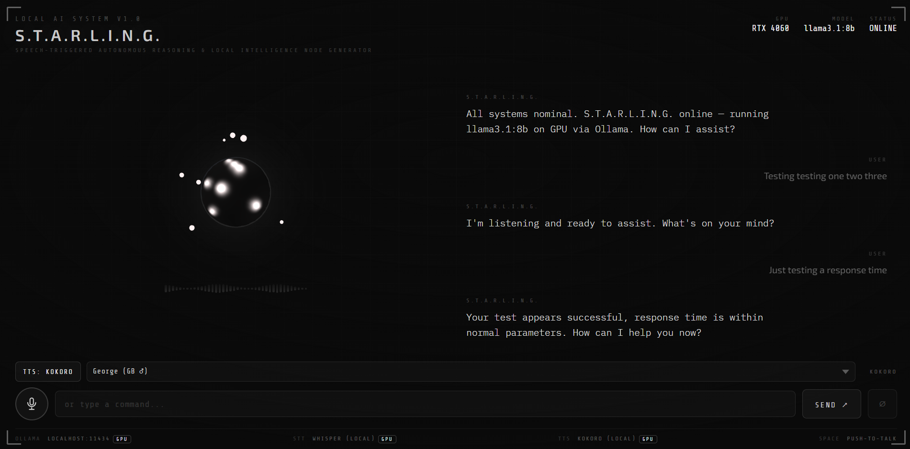

# Speech to text Local AI Interface

A voice-driven, S.T.A.R.L.I.N.G. (Speech‑Triggered Autonomous Reasoning & Local Intelligence Node Generator) web interface powered entirely by a local LLM running on your GPU. No cloud APIs. No subscriptions. Just your hardware.

```
Microphone → Speech-to-Text → Ollama (LLM on GPU) → Text-to-Speech → Browser UI
```



---

## Features

- 🎙 **Voice input** via browser MediaRecorder API → local faster-whisper (Whisper)
- 🧠 **Local LLM inference** via Ollama (Llama 3, Mistral, Gemma 2, and more)
- 🔊 **Text-to-speech** via Kokoro TTS (local, GPU-accelerated) or browser SpeechSynthesis
- 📡 **Sentence-chunked streaming** — each sentence is synthesised and played as it arrives
- 💬 **Multi-turn conversation** with persistent context
- 🌑 **Living black sphere** — Three.js scene with 7 orbiting light orbs; reacts to audio input and shifts colour/speed per state (idle / listening / thinking / speaking)
- ⚡ **Model warm-up on load** — Kokoro and Whisper CUDA sessions are pre-heated at startup; UI shows `INITIALISING…` and GPU badges populate before the user speaks
- 🔒 **Fully local** — no data leaves your machine

---

## Requirements

- **OS:** Linux, macOS, or Windows
- **GPU:** NVIDIA GPU with 6 GB+ VRAM (CUDA 12+), or DirectX 12-capable GPU (DirectML)
- **Python:** 3.11+
- **Node.js:** 18+ (only if using the React/Vite frontend)
- **Browser:** Chrome or Edge (required for MediaRecorder / Web Speech API fallback)

### Recommended GPU / model pairings

| GPU VRAM | Recommended model | Pull command |
|---|---|---|
| 4–6 GB | `gemma3:4b`, `phi4-mini`, `llama3.2:3b` | `ollama pull gemma3:4b` |
| 6–8 GB | `llama3.1:8b`, `mistral:7b`, `qwen2.5:7b` | `ollama pull llama3.1:8b` |
| 10–16 GB | `llama3.1:13b`, `mistral:12b` | `ollama pull llama3.1:13b` |
| 40 GB+ | `llama3.1:70b` | `ollama pull llama3.1:70b` |

### Currently installed models

| Model | Size | Notes |
|---|---|---|
| `llama3.1:8b` | 4.9 GB | Strong general purpose |
| `mistral:7b` | 4.4 GB | Fast, good instruction following |
| `qwen2.5:7b` | 4.7 GB | Strong coding and reasoning |
| `gemma3:4b` | 3.3 GB | **Default** — lightweight, good for low VRAM |
| `llama3.2:3b` | 2.0 GB | Fastest response times |
| `phi4-mini` | 2.5 GB | Microsoft, strong reasoning for its size |
| `nomic-embed-text` | 274 MB | Embedding model (for future RAG) |

Change the active model by setting `OLLAMA_MODEL` in `.env` or `localStorage.setItem('starling_model', 'mistral:7b')` in the browser console.

---

## Project Structure

```
llm-speech-UI/
├── frontend/           # UI — HTML/CSS/JS (or React + Vite)
│   ├── index.html
│   ├── style.css
│   └── app.js
├── backend/            # FastAPI server (optional — needed for Whisper / Kokoro TTS)
│   ├── main.py
│   ├── stt.py          # Speech-to-text via faster-whisper
│   ├── tts.py          # Text-to-speech via Kokoro or Piper
│   └── ollama.py       # Ollama streaming client
├── scripts/
│   └── setup.sh        # One-shot install script
├── .env.example        # Environment variable template
├── requirements.txt    # Python dependencies
├── TODO.md             # Project build checklist
└── README.md
```

---

## Quickstart

### 1. Install Ollama and pull a model

```bash
# Install Ollama
curl -fsSL https://ollama.com/install.sh | sh

# Pull your chosen model
ollama pull llama3

# Verify it's running on your GPU
ollama run llama3
# then: nvidia-smi (should show GPU memory in use)
```

### 2. Clone the repo

```bash
git clone https://github.com/danielbsimpson/llm-speech-UI.git
cd llm-speech-UI
```

### 3a. Frontend only (easiest — no Python needed)

Open `frontend/index.html` directly in Chrome. The UI talks to Ollama at `http://localhost:11434` via `fetch()`. Uses browser-native STT and TTS.

```bash
# Optional: use a local dev server for cleaner DX
npx live-server frontend/
```

### 3b. Full stack (Whisper STT + Kokoro TTS)

```bash
# Create a virtual environment
python -m venv .venv
source .venv/bin/activate  # Windows: .venv\Scripts\activate

# Install dependencies
pip install -r requirements.txt

# Download Kokoro model files (~330 MB)
python scripts/download_models.py

# Copy and configure environment variables
cp .env.example .env
# Edit .env with your model name, ports, etc.

# Start the backend (must run from backend/ directory)
cd backend
uvicorn main:app --reload --port 8000

# Open the frontend
open frontend/index.html  # or serve it with live-server
```

---

## Configuration

Copy `.env.example` to `.env` and edit as needed:

```env
# Ollama
OLLAMA_BASE_URL=http://localhost:11434
OLLAMA_MODEL=gemma3:4b
OLLAMA_TEMPERATURE=0.7
OLLAMA_SYSTEM_PROMPT=You are S.T.A.R.L.I.N.G. ...

# Backend
BACKEND_PORT=8000

# STT — faster-whisper
WHISPER_MODEL_SIZE=base   # tiny | base | small | medium | large-v3
WHISPER_DEVICE=cuda       # set to cpu if CUDA unavailable

# TTS — Kokoro ONNX
ONNX_PROVIDER=DmlExecutionProvider   # DirectML (no CUDA toolkit required)
# Use CUDAExecutionProvider + onnxruntime-gpu if CUDA 12 + cuDNN 9 are installed
# Use CPUExecutionProvider if no GPU acceleration is available
```

---

## STT Options

| Engine | Setup | Accuracy | Latency | Privacy |
|---|---|---|---|---|
| Web Speech API | Zero | Good | Fast | ⚠️ Sent to Google |
| faster-whisper | `pip install faster-whisper` | Excellent | Medium | ✅ Fully local |

To use Whisper, set `STT_ENGINE=whisper` in `.env` and ensure the FastAPI backend is running. The frontend will POST audio blobs to `/transcribe`.

---

## TTS Options

| Engine | Setup | Quality | Latency |
|---|---|---|---|
| SpeechSynthesis | Zero (browser built-in) | OK | Instant |
| Kokoro TTS | `pip install kokoro-onnx` | Excellent | Low |
| Piper TTS | Download binary + voice model | Good | Very low |

---

## API Reference (FastAPI backend)

| Endpoint | Method | Description |
|---|---|---|
| `/chat` | POST | Send a message, stream Ollama response |
| `/transcribe` | POST | Upload audio blob, returns transcript |
| `/synthesize` | POST | Send text, returns WAV audio |
| `/synthesize/voices` | GET | List available Kokoro voices |
| `/health` | GET | Check backend status |
| `/system-status` | GET | Per-model device report (GPU/CPU/IDLE/OFFLINE) |

### Example: stream a chat response

```bash
curl -X POST http://localhost:8000/chat \
  -H "Content-Type: application/json" \
  -d '{"message": "What is the speed of light?", "history": []}'
```

---

## Troubleshooting

**Ollama isn't using my GPU**
Run `nvidia-smi` while a model is loaded. If VRAM usage is 0, check that your CUDA drivers are up to date and that you installed the CUDA version of Ollama.

**Web Speech API not working**
Chrome and Edge only — Firefox does not support `webkitSpeechRecognition`. Also requires HTTPS or `localhost`.

**CORS errors in the browser**
If using the FastAPI backend, ensure CORS is enabled in `main.py` for your frontend origin. The `.env` has a `CORS_ORIGIN` variable for this.

**Model responses are slow**
Try a smaller model (`mistral:7b` is fast and capable). Also check that you're not CPU-falling-back — `ollama ps` shows which layers are on GPU vs CPU.

**Audio not playing after TTS**
Browsers enforce an autoplay policy that blocks `audio.play()` until the user has made a gesture (click or keypress) on the page. This is by design — TTS playback is triggered by the user's mic press or send button, which satisfies the policy. The startup greeting is intentionally text-only for this reason.

---

## Roadmap

See [TODO.md](./TODO.md) for the full phased build checklist.

High-level milestones:
- [x] Project scaffolding and documentation
- [x] Ollama integration with streaming responses
- [x] Push-to-talk voice input (MediaRecorder → Whisper STT on GPU)
- [x] Kokoro TTS with 16 curated voices, sentence-chunked playback, and mode toggle
- [x] Living black sphere (Three.js) — 7 orbiting light orbs, audio-driven deformation, 4-state machine
- [x] Per-model GPU/CPU device reporting in footer (`/system-status`)
- [x] Model warm-up on page load — Kokoro + Whisper pre-heated, GPU badges populated before first mic press
- [x] GPU dispatch working for both Whisper (CUDA) and Kokoro (DirectML / CUDA)
- [ ] Sentence-chunked TTS latency further tuning
- [ ] Tool use / function calling
- [ ] Electron desktop app packaging
- [ ] Local RAG / GraphRAG over a documents folder

---

## Contributing

Pull requests welcome. Please open an issue first to discuss major changes. Keep PRs focused — one feature or fix per PR.

```bash
# Run the backend in dev mode (must run from backend/ directory)
cd backend && uvicorn main:app --reload --port 8000

# Lint Python
pip install ruff && ruff check backend/
```

---

## License

MIT — do whatever you want, no warranty implied.

---

> *"At your service."*